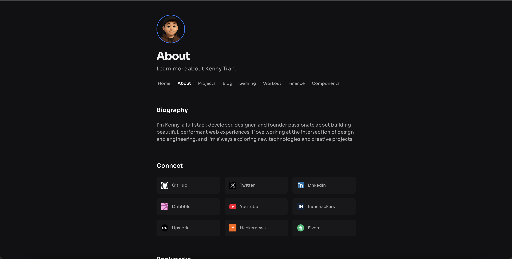

# kennyt.me

A modern, feature-rich portfolio template built with Next.js 15+ and TypeScript. This template serves as a starting point for developers looking to create their own personal portfolio website, featuring a blog, project showcase, and various interactive sections.

## ✨ Why This Template?

- **Production-Ready**: Built with best practices and modern web standards
- **Fully Featured**: Includes blog, projects, tech stack, and more
- **Type-Safe**: Built with TypeScript for better development experience
- **Customizable**: Easy to modify and extend to fit your needs
- **Well-Documented**: Comprehensive documentation and clear code structure
- **Modern Stack**: Uses Next.js App Router, Tailwind CSS, and MongoDB

---

## 🖼️ Screenshots

<!-- Add screenshots here -->


---



## 🛠️ Tech Stack

- **Frontend:** Next.js (App Router), React, TypeScript, Tailwind CSS
- **UI/UX:** Lucide Icons, Motion, Custom Fonts
- **Analytics:** Google Analytics
- **SEO:** Next.js Metadata API, Open Graph, Twitter Card, JSON-LD
- **Tooling:** ESLint, Prettier, pnpm
- **Other:** Google Favicon API

## 📁 Project Structure

```
kennyt.me/
├── app/                    # Next.js App Router directory
│   ├── api/               # API routes
│   ├── about/             # About page
│   ├── blog/              # Blog page
│   ├── finance/           # Finance page
│   ├── gaming/            # Gaming page
│   ├── projects/          # Projects page
│   ├── workout/           # Workout page
│   ├── layout.tsx         # Root layout
│   ├── page.tsx           # Home page
│   ├── loading.tsx        # Landing page loading state
│   ├── error.tsx          # Error boundary
│   └── not-found.tsx      # 404 page
├── components/            # Reusable React components
├── lib/                   # Core utilities and data layer
│   ├── data/             # Data methods and operations
│   ├── db/               # Core database operations layer
│   │   ├── create.ts     # Generic create operations
│   │   ├── read.ts       # Generic read operations
│   │   ├── update.ts     # Generic update operations
│   │   ├── delete.ts     # Generic delete operations
│   │   └── types.ts      # Database types and interfaces
│   └── utils.ts          # Utility functions
├── types/                # TypeScript type definitions
├── public/               # Static assets
├── hooks/                # Custom React hooks
└── .vscode/             # VS Code configuration
```

## 🔍 Code Quality

The project uses lint-staged to automatically format code with Prettier before commits. This ensures consistent code style across the project. The setup is minimal but extensible, allowing you to add more complex code quality checks as needed.

### Pre-commit Setup

1. **Installation**

   ```bash
   pnpm install
   ```

   This will automatically set up lint-staged.

2. **Current Configuration**

   ```json
   {
     "lint-staged": {
       "*.{ts,tsx,js,jsx,json,md}": "prettier --write"
     }
   }
   ```

3. **Skipping Formatting**
   ```bash
   git commit -m "your message" --no-verify
   ```
   ⚠️ Use with caution - only skip checks when absolutely necessary.

## 💾 Data Layer

The application uses a type-safe data layer built with MongoDB and TypeScript. The data layer is organized into two main components:

### 1. Generic Operations Layer

A reusable, type-safe foundation for database operations:

- **Create:** `CreateOperations<T extends BaseDocument>`

  - Handles single and bulk document creation
  - Type-safe document insertion
  - Automatic timestamp handling

- **Read:** `ReadOperations<T extends BaseDocument>`

  - Flexible querying with MongoDB filters
  - Projection support for optimized queries
  - Sorting and pagination capabilities

- **Update:** `UpdateOperations<T extends BaseDocument>`

  - Single and bulk document updates
  - Partial update support
  - Atomic operations

- **Delete:** `DeleteOperations<T extends BaseDocument>`
  - Single and bulk document deletion
  - Filter-based deletion
  - Safe deletion with type checking

### 2. Domain-Specific Data Methods

Type-safe methods for each domain of the application:

- **Blog:** `lib/data/blog.ts`

  - Article management
  - Featured articles
  - Content organization

- **Projects:** `lib/data/projects.ts`
  - Project showcase
  - Technology stack
  - Project metadata

Each data method file:

- Extends the generic operations layer
- Provides domain-specific functionality
- Includes helper methods for common queries
- Implements seed operations for development
- Maintains type safety throughout

### Usage Example

```typescript
// Using the generic operations layer
const createOps = new CreateOperations<Article>(db, "articles");
await createOps.createOne(newArticle);

// Using domain-specific methods
const articles = await getArticles();
const featured = await getFeaturedArticles();
```

This architecture provides:

- Type safety across the entire data layer
- Reusable database operations
- Domain-specific functionality
- Consistent error handling
- Easy testing and mocking
- Clear separation of concerns

## Loading States

The application implements progressive loading states using Next.js's built-in loading UI feature. Each page has a corresponding `loading.tsx` file that shows a loading state while the page content is being fetched.

This approach provides a better user experience by:

- Showing static content immediately
- Using shimmer effects to indicate loading states
- Maintaining layout stability during loading
- Reducing perceived loading time

For more information about loading states in Next.js, see the [official documentation](https://nextjs.org/docs/app/api-reference/file-conventions/loading).

## Error Handling

The application implements a robust error handling system using Next.js 13+ error handling features:

### Global Error Page

- Located at `app/error.tsx`
- Handles runtime errors in the application
- Provides user-friendly error messages
- Includes "Try Again" and "Go back home" options
- Logs errors to console (can be extended to error reporting services)

### Not Found Page

- Located at `app/not-found.tsx`
- Handles 404 errors for non-existent routes
- Consistent styling with error page
- Clear navigation back to homepage

### API Error Handling

- All API routes include try-catch blocks
- Standardized error response format:
  ```typescript
  {
    error: string;
    message: string;
  }
  ```

For more information about Next.js error handling, refer to the [official documentation](https://nextjs.org/docs/app/getting-started/error-handling).

## API Security

### Protected Endpoints

Certain API endpoints require a secret header for security. These endpoints are used for seeding and deleting data, and should only be accessible in development or through secure means.

#### Required Header

```http
x-secret: <your-secret>
```

The secret value should match the `SECRET` environment variable.

#### Example Usage

```bash
# Seeding data
curl -X POST http://localhost:3000/api/gaming/heroes/seed \
  -H "x-secret: your-secret-here"

# Deleting data
curl -X DELETE http://localhost:3000/api/gaming/heroes/delete \
  -H "x-secret: your-secret-here"
```

#### Error Responses

If the secret header is missing or incorrect, the API will return a 403 Forbidden response:

```json
{
  "error": "Unauthorized"
}
```

---

## 📝 Contributing

Contributions are welcome! Please read the [Contributing Guide](./CONTRIBUTING.md) and [Code of Conduct](./CODE_OF_CONDUCT.md) before submitting issues or pull requests.

- [Open an Issue](https://github.com/iamk3nnyt/kennyt.me/issues)
- [Submit a Pull Request](https://github.com/iamk3nnyt/kennyt.me/pulls)

---

## 🏁 Getting Started

1. **Clone the repo:**
   ```sh
   git clone https://github.com/iamk3nnyt/kennyt.me.git
   cd kennyt.me
   ```
2. **Install dependencies:**
   ```sh
   pnpm install
   ```
3. **Set up environment variables:**
   - Copy `.env.example` to `.env.local` and fill in any required values
4. **Run the dev server:**
   ```sh
   pnpm dev
   ```
5. **Open [http://localhost:3000](http://localhost:3000) in your browser.**

---

## 📄 License

This project is [MIT licensed](./LICENSE).
